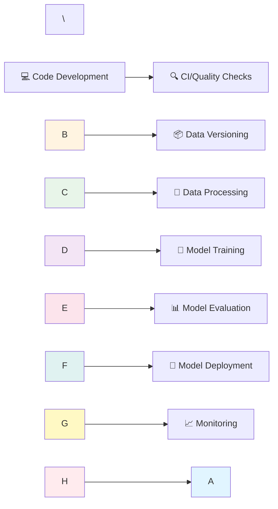

# 🚀 KlinikOps MLOps Pipeline Project


<<<<<<< HEAD


\[!\\\[Pipeline Status](https://github.com/YOUR\\\_USERNAME/YOUR\\\_REPOSITORY/actions/workflows/mlops\\\_pipeline.yml/badge.svg)](https://github.com/YOUR\\\_USERNAME/YOUR\\\_REPOSITORY/actions/workflows/mlops\\\_pipeline.yml)


\[!\\\[Python 3.11](https://img.shields.io/badge/Python-3.11-blue?logo=python\\\&logoColor=white)](https://www.python.org/)


\[!\\\[DVC](https://img.shields.io/badge/Data%20Versioning-DVC-green?logo=dataversioncontrol\\\&logoColor=white)](https://dvc.org/)


\[!\\\[Azure](https://img.shields.io/badge/Cloud-Azure-0078D4?logo=microsoftazure\\\&logoColor=white)](https://azure.microsoft.com/)


=======
[!\[Pipeline Status](https://github.com/YOUR\_USERNAME/YOUR\_REPOSITORY/actions/workflows/mlops\_pipeline.yml/badge.svg)](https://github.com/YOUR\_USERNAME/YOUR\_REPOSITORY/actions/workflows/mlops\_pipeline.yml)

[!\[Python 3.11](https://img.shields.io/badge/Python-3.11-blue?logo=python\&logoColor=white)](https://www.python.org/)

[!\[DVC](https://img.shields.io/badge/Data%20Versioning-DVC-green?logo=dataversioncontrol\&logoColor=white)](https://dvc.org/)

[!\[Azure](https://img.shields.io/badge/Cloud-Azure-0078D4?logo=microsoftazure\&logoColor=white)](https://azure.microsoft.com/)
>>>>>>> 11645a20989bac1415d4090c23e8df8c78bdf0eb


---


<<<<<<< HEAD


\## 📋 Table of Contents


\- \\\[About the Project](#-about-the-project)


\- \\\[MLOps Lifecycle](#-mlops-lifecycle)


\- \\\[Technology Stack](#-technology-stack)


\- \\\[Pipeline Stages](#-pipeline-stages)


\- \\\[Setup Instructions](#-setup-instructions)


\- \\\[Usage](#-usage)


=======
## 📋 Table of Contents


- \[About the Project](#-about-the-project)

- \[MLOps Lifecycle](#-mlops-lifecycle)

- \[Technology Stack](#-technology-stack)

- \[Pipeline Stages](#-pipeline-stages)

- \[Setup Instructions](#-setup-instructions)

- \[Usage](#-usage)
>>>>>>> 11645a20989bac1415d4090c23e8df8c78bdf0eb


---


<<<<<<< HEAD


\## 🎯 About the Project
=======
## 🎯 About the Project
>>>>>>> 11645a20989bac1415d4090c23e8df8c78bdf0eb


This repository hosts an end-to-end \\\*\\\*MLOps (Machine Learning Operations)\\\*\\\* pipeline designed to process critical patient data, train machine learning models, and archive results as deployable artifacts.


The pipeline successfully combines code quality checks (CI), data version control (DVC), and model training (CD) into a single, unified workflow (`mlops\\\_pipeline.yml`).


### ✨ Key Features


<<<<<<< HEAD


\- 🔄 \\\*\\\*Continuous Integration\\\*\\\*: Automated code quality checks and testing


\- 📊 \\\*\\\*Data Versioning\\\*\\\*: DVC-powered data management with Azure Blob Storage


\- 🤖 \\\*\\\*Automated Training\\\*\\\*: ML model training with MLflow tracking


\- 📦 \\\*\\\*Artifact Management\\\*\\\*: GitHub Actions artifacts for deployment readiness


\- ✅ \\\*\\\*Quality Assurance\\\*\\\*: PEP8 compliance and comprehensive unit tests


=======
- 🔄 \*\*Continuous Integration\*\*: Automated code quality checks and testing

- 📊 \*\*Data Versioning\*\*: DVC-powered data management with Azure Blob Storage

- 🤖 \*\*Automated Training\*\*: ML model training with MLflow tracking

- 📦 \*\*Artifact Management\*\*: GitHub Actions artifacts for deployment readiness

- ✅ \*\*Quality Assurance\*\*: PEP8 compliance and comprehensive unit tests
>>>>>>> 11645a20989bac1415d4090c23e8df8c78bdf0eb


---


<<<<<<< HEAD


\## 🔄 MLOps Lifecycle
=======
## 🔄 MLOps Lifecycle
>>>>>>> 11645a20989bac1415d4090c23e8df8c78bdf0eb





<<<<<<< HEAD


\### The MLOps Cycle
=======
### The MLOps Cycle
>>>>>>> 11645a20989bac1415d4090c23e8df8c78bdf0eb


```


┌─────────────────────────────────────────────────────────────┐


│                    MLOps Pipeline Flow                       │


└─────────────────────────────────────────────────────────────┘


\&nbsp;   1. CODE          2. BUILD         3. TRAIN        4. DEPLOY


\&nbsp;      📝                🔨               🎯              🚀


\&nbsp;      │                 │                │               │


\&nbsp;      ├─► Git          ├─► CI/CD        ├─► MLflow     ├─► Artifacts


\&nbsp;      ├─► Python      ├─► Tests        ├─► DVC        └─► Monitoring


\&nbsp;      └─► Flake8      └─► Quality      └─► Azure              │


\&nbsp;                                                                │


\&nbsp;                                                                ▼


\&nbsp;   ◄────────────────────── FEEDBACK ◄──────────────────────────┘


```


---


<<<<<<< HEAD


\## 🛠️ Technology Stack
=======
## 🛠️ Technology Stack
>>>>>>> 11645a20989bac1415d4090c23e8df8c78bdf0eb


| Category | Tool | Purpose |


|:---------|:-----|:--------|


| \\\*\\\*Version Control\\\*\\\* | !\\\[Git](https://img.shields.io/badge/Git-F05032?logo=git\\\&logoColor=white) | Code versioning and collaboration |


| \\\*\\\*Data Versioning\\\*\\\* | !\\\[DVC](https://img.shields.io/badge/DVC-13ADC7?logo=dataversioncontrol\\\&logoColor=white) | Large file and dataset versioning |


| \\\*\\\*Cloud Storage\\\*\\\* | !\\\[Azure](https://img.shields.io/badge/Azure\\\_Blob-0078D4?logo=microsoftazure\\\&logoColor=white) | Remote data storage and backup |


| \\\*\\\*CI/CD\\\*\\\* | !\\\[GitHub Actions](https://img.shields.io/badge/GitHub\\\_Actions-2088FF?logo=githubactions\\\&logoColor=white) | Automated pipeline orchestration |


| \\\*\\\*ML Tracking\\\*\\\* | !\\\[MLflow](https://img.shields.io/badge/MLflow-0194E2?logo=mlflow\\\&logoColor=white) | Experiment tracking and model registry |


| \\\*\\\*Testing\\\*\\\* | !\\\[Pytest](https://img.shields.io/badge/Pytest-0A9EDC?logo=pytest\\\&logoColor=white) | Unit and integration testing |


| \\\*\\\*Code Quality\\\*\\\* | !\\\[Flake8](https://img.shields.io/badge/Flake8-3776AB?logo=python\\\&logoColor=white) | PEP8 compliance and linting |


---


<<<<<<< HEAD


\## 📊 Pipeline Stages
=======
## 📊 Pipeline Stages
>>>>>>> 11645a20989bac1415d4090c23e8df8c78bdf0eb


The pipeline consists of five main stages that execute automatically on every push:


```


┌──────────────┐     ┌──────────────┐     ┌──────────────┐     ┌──────────────┐     ┌──────────────┐


│   Stage 1    │────▶│   Stage 2    │────▶│   Stage 3    │────▶│   Stage 4    │────▶│   Stage 5    │


│              │     │              │     │              │     │              │     │              │


│  Code QA \\\&   │     │     Data     │     │  Data Pull   │     │    Model     │     │    Model     │


│   Testing    │     │  Versioning  │     │   \\\& Prep     │     │   Training   │     │  Archiving   │


│              │     │              │     │              │     │              │     │              │


│  ✓ Flake8    │     │  ✓ DVC       │     │  ✓ DVC Pull  │     │  ✓ Train.py  │     │  ✓ Artifacts │


│  ✓ Pytest    │     │  ✓ Azure     │     │  ✓ Process   │     │  ✓ MLflow    │     │  ✓ GitHub    │


└──────────────┘     └──────────────┘     └──────────────┘     └──────────────┘     └──────────────┘


```


<<<<<<< HEAD


\### Detailed Stage Breakdown
=======
### Detailed Stage Breakdown
>>>>>>> 11645a20989bac1415d4090c23e8df8c78bdf0eb


| Stage | Tools | Status | Description |


|:------|:------|:------:|:------------|


| \\\*\\\*1️⃣ CI/Code Quality\\\*\\\* | GitHub Actions, Flake8, Pytest | ✅ | Validates code against PEP8 standards and runs all unit tests |


| \\\*\\\*2️⃣ Data Versioning\\\*\\\* | DVC, Azure Blob Storage | ✅ | Versions raw data (`Patient\\\_Stay\\\_Data.csv`) securely on Azure, untracked by Git |


| \\\*\\\*3️⃣ Data Pull \\\& Prep\\\*\\\* | DVC Pull, `data\\\_processing.py` | ✅ | Pulls versioned data from Azure, preprocesses, and creates train/test splits |


| \\\*\\\*4️⃣ Model Training\\\*\\\* | `train.py`, MLflow | ✅ | Trains the model, logs parameters/metrics, saves model artifacts to MLflow |


| \\\*\\\*5️⃣ Model Archiving\\\*\\\* | GitHub Actions Artifacts | ✅ | Archives MLflow artifacts (`mlruns/`) on GitHub for deployment readiness |


---


<<<<<<< HEAD


\## ⚙️ Setup Instructions


\### Prerequisites
=======
## ⚙️ Setup Instructions


### Prerequisites
>>>>>>> 11645a20989bac1415d4090c23e8df8c78bdf0eb


Before you begin, ensure you have the following installed:


<<<<<<< HEAD


\- 🐍 \\\*\\\*Python 3.11\\\*\\\*


\- 📦 \\\*\\\*Git\\\*\\\*


\- 📊 \\\*\\\*DVC\\\*\\\*


\- ☁️ \\\*\\\*Azure Account\\\*\\\* with Storage Account and Access Key


=======
- 🐍 \*\*Python 3.11\*\*

- 📦 \*\*Git\*\*

- 📊 \*\*DVC\*\*

- ☁️ \*\*Azure Account\*\* with Storage Account and Access Key
>>>>>>> 11645a20989bac1415d4090c23e8df8c78bdf0eb


### 1. Clone the Repository


```bash


git clone https://github.com/YOUR\\\_USERNAME/YOUR\\\_REPOSITORY.git


cd YOUR\\\_REPOSITORY


```


<<<<<<< HEAD


\### 2. Environment Setup
=======
### 2. Environment Setup
>>>>>>> 11645a20989bac1415d4090c23e8df8c78bdf0eb


Create and activate a virtual environment, then install dependencies:


```bash

<<<<<<< HEAD


\# Create and activate virtual environment
=======
# Create and activate virtual environment
>>>>>>> 11645a20989bac1415d4090c23e8df8c78bdf0eb


conda create -n klinikops\\\_env python=3.11


conda activate klinikops\\\_env


# Install all dependencies including DVC Azure extension


pip install -r requirements.txt


pip install 'dvc\\\[azure]'


```


<<<<<<< HEAD


\### 3. Initialize DVC and Configure Azure Remote


\#### Step A: Initialize DVC
=======
### 3. Initialize DVC and Configure Azure Remote


#### Step A: Initialize DVC
>>>>>>> 11645a20989bac1415d4090c23e8df8c78bdf0eb


```bash

<<<<<<< HEAD


\# Initialize DVC (creates the .dvc/ directory)
=======
# Initialize DVC (creates the .dvc/ directory)
>>>>>>> 11645a20989bac1415d4090c23e8df8c78bdf0eb


dvc init


```


<<<<<<< HEAD


\#### Step B: Add Azure Remote
=======
#### Step B: Add Azure Remote
>>>>>>> 11645a20989bac1415d4090c23e8df8c78bdf0eb


Configure the Azure Blob Storage remote using the correct URI format:


```bash

<<<<<<< HEAD


\# Define the Azure Remote URL
=======
# Define the Azure Remote URL
>>>>>>> 11645a20989bac1415d4090c23e8df8c78bdf0eb


dvc remote add -d azure\\\_remote azure://clinicopsdvcstorage2025/dvc-remote


```


<<<<<<< HEAD


\*\\\*URI Format Explanation:\\\*\\\*


=======
*\*URI Format Explanation:\*\*
>>>>>>> 11645a20989bac1415d4090c23e8df8c78bdf0eb

- `azure://` - Protocol for Azure Blob Storage

<<<<<<< HEAD


\- `clinicopsdvcstorage2025` - Your Storage Account name


\- `dvc-remote` - Your container name


\#### Step C: Configure Azure Authentication
=======
- `clinicopsdvcstorage2025` - Your Storage Account name

- `dvc-remote` - Your container name


#### Step C: Configure Azure Authentication
>>>>>>> 11645a20989bac1415d4090c23e8df8c78bdf0eb


For security, store your Azure credentials in `.dvc/config.local` (automatically ignored by Git):


1\\. Locate your \\\*\\\*Azure Storage Access Key\\\*\\\* from the Azure Portal (Storage Account → Access Keys)


2\\. Create or edit `.dvc/config.local` in your project root:


```bash


nano .dvc/config.local


```


3\\. Add the following configuration (replace with your actual key):


```ini

<<<<<<< HEAD


\# .dvc/config.local (IGNORED BY GIT)

=======
# .dvc/config.local (IGNORED BY GIT)

['remote "azure\_remote"']
>>>>>>> 11645a20989bac1415d4090c23e8df8c78bdf0eb


\['remote "azure\\\_remote"']


\&nbsp;   account\\\_name = clinicopsdvcstorage2025


\&nbsp;   account\\\_key = YOUR\\\_ACTUAL\\\_AZURE\\\_ACCESS\\\_KEY\\\_HERE


```


4\\. Verify the configuration:


```bash


dvc remote list


dvc config --local -l


```


---


<<<<<<< HEAD


\## 🚀 Usage


\### Pull Data from Azure
=======
## 🚀 Usage


### Pull Data from Azure
>>>>>>> 11645a20989bac1415d4090c23e8df8c78bdf0eb


```bash


dvc pull


```


<<<<<<< HEAD


\### Run Data Processing
=======
### Run Data Processing
>>>>>>> 11645a20989bac1415d4090c23e8df8c78bdf0eb


```bash


python scripts/data\\\_processing.py


```


<<<<<<< HEAD


\### Train the Model
=======
### Train the Model
>>>>>>> 11645a20989bac1415d4090c23e8df8c78bdf0eb


```bash


python scripts/train.py


```


<<<<<<< HEAD


\### Run Tests
=======
### Run Tests
>>>>>>> 11645a20989bac1415d4090c23e8df8c78bdf0eb


```bash


pytest tests/


```


<<<<<<< HEAD


\### Check Code Quality
=======
### Check Code Quality
>>>>>>> 11645a20989bac1415d4090c23e8df8c78bdf0eb


```bash


flake8 scripts/ tests/


```


---


<<<<<<< HEAD


\## 📁 Project Structure
=======
## 📁 Project Structure
>>>>>>> 11645a20989bac1415d4090c23e8df8c78bdf0eb


```


klinikops-mlops/


├── .dvc/                      # DVC configuration


├── .github/


│   └── workflows/


│       └── mlops\\\_pipeline.yml # CI/CD pipeline definition


├── data/                      # Data directory (DVC tracked)


│   └── Patient\\\_Stay\\\_Data.csv.dvc


├── scripts/


│   ├── data\\\_processing.py     # Data preprocessing


│   └── train.py               # Model training


├── tests/                     # Unit tests


├── mlruns/                    # MLflow experiments


├── requirements.txt           # Python dependencies


└── README.md                  # This file


```


---


<<<<<<< HEAD


\## 🤝 Contributing
=======
## 🤝 Contributing
>>>>>>> 11645a20989bac1415d4090c23e8df8c78bdf0eb


Contributions are welcome! Please follow these steps:


1\\. Fork the repository


2\\. Create a feature branch (`git checkout -b feature/AmazingFeature`)


3\\. Commit your changes (`git commit -m 'Add some AmazingFeature'`)


4\\. Push to the branch (`git push origin feature/AmazingFeature`)


5\\. Open a Pull Request


---


<<<<<<< HEAD


\## 📄 License
=======
## 📄 License
>>>>>>> 11645a20989bac1415d4090c23e8df8c78bdf0eb


This project is licensed under the MIT License - see the LICENSE file for details.


---


<<<<<<< HEAD


\## 📧 Contact
=======
## 📧 Contact
>>>>>>> 11645a20989bac1415d4090c23e8df8c78bdf0eb


For questions or support, please open an issue in this repository.


---


<div align="center">


<<<<<<< HEAD
=======
*\*Made with ❤️ for Healthcare ML Operations\*\*
>>>>>>> 11645a20989bac1415d4090c23e8df8c78bdf0eb


\*\\\*Made with ❤️ for Healthcare ML Operations\\\*\\\*


!\\\[MLOps](https://img.shields.io/badge/MLOps-Enabled-success?style=for-the-badge)


!\\\[Production Ready](https://img.shields.io/badge/Production-Ready-blue?style=for-the-badge)


</div>


