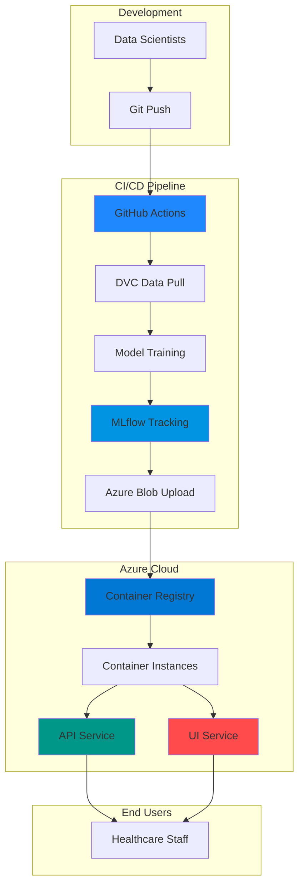

# 🏥 ClinicOps - Healthcare MLOps Platform

[](https://azure.microsoft.com/)
[](https://www.python.org/)
[](https://mlflow.org/)
[](https://fastapi.tiangolo.com/)
[](https://streamlit.io/)

> **Production-ready MLOps pipeline for predicting hospital length of stay using Azure cloud infrastructure, automated CI/CD, and real-time model deployment.**

---

## 📋 Table of Contents

- [Overview](#-overview)
- [Architecture](#-architecture)
- [Technology Stack](#-technology-stack)
- [Key Features](#-key-features)
- [Pipeline Flow](#-pipeline-flow)
- [Live Demo](#-live-demo)
- [Local Setup](#-local-setup)
- [Deployment](#-deployment)
- [Project Structure](#-project-structure)
- [Results & Metrics](#-results--metrics)

---

## 🎯 Overview

**ClinicOps** is an end-to-end machine learning operations platform that predicts patient length of stay in hospitals. The system automatically trains models, deploys them to production, and provides a user-friendly interface for healthcare professionals.

### Business Impact
- 📊 **Predictive Analytics**: Forecast patient stay duration with 91.8% accuracy
- ⚡ **Real-time Inference**: Sub-second API response times
- 🔄 **Automated Retraining**: CI/CD pipeline ensures models stay current
- 💰 **Cost Optimization**: On-demand deployment reduces cloud costs by 95%

### Use Case
Healthcare administrators input patient vitals and medical history. The system predicts length of stay, enabling better:
- 🛏️ Bed allocation planning
- 👥 Staff scheduling optimization
- 💊 Resource management
- 📈 Hospital capacity forecasting

---

## 🏗️ Architecture



### System Components

| Component | Technology | Purpose |
|-----------|-----------|---------|
| **Data Versioning** | DVC + Azure Blob | Track 100K+ patient records |
| **Model Training** | Scikit-learn + MLflow | Random Forest Regressor (R² = 0.918) |
| **Model Registry** | Azure Blob Storage | Centralized artifact storage |
| **REST API** | FastAPI + Uvicorn | High-performance inference endpoint |
| **Web Interface** | Streamlit | Interactive prediction dashboard |
| **Container Orchestration** | Azure Container Instances | On-demand deployment |
| **CI/CD** | GitHub Actions | Automated testing & deployment |

---

## 🛠️ Technology Stack

### Core Technologies

<table>
<tr>
<td align="center" width="25%">

<br><b>Python 3.11</b>
<br>Core Language
</td>
<td align="center" width="25%">

<br><b>Azure Cloud</b>
<br>Infrastructure
</td>
<td align="center" width="25%">

<br><b>Docker</b>
<br>Containerization
</td>
<td align="center" width="25%">

<br><b>GitHub Actions</b>
<br>CI/CD
</td>
</tr>
</table>

### ML & Data Stack

```
📊 Data Processing    → Pandas, NumPy, Scikit-learn
🤖 ML Framework       → Scikit-learn (RandomForestRegressor)
📈 Experiment Tracking → MLflow (versioning, metrics, artifacts)
🗃️ Data Versioning    → DVC (Data Version Control)
☁️ Storage            → Azure Blob Storage
```

### Deployment Stack

```
🚀 API Framework      → FastAPI (async REST API)
🎨 Frontend           → Streamlit (interactive dashboard)
🐳 Containers         → Docker + Azure Container Registry
⚙️ Orchestration      → Azure Container Instances (ACI)
🔐 Secrets Management → GitHub Secrets
```

---

## ✨ Key Features

### 1. **Automated MLOps Pipeline** 🔄

- ✅ **Continuous Training**: Models retrain on new data automatically
- ✅ **Version Control**: Every model, dataset, and code change is tracked
- ✅ **Quality Gates**: Automated testing before deployment
- ✅ **Rollback Support**: Instant rollback to previous model versions

### 2. **Production-Grade API** ⚡

```python
# Example API Request
POST /predict
{
  "hematocrit": 35.0,
  "glucose": 100.0,
  "bmi": 25.0,
  "gender": "F",
  "pneum": 0,
  ...
}

# Response (< 100ms)
{
  "predicted_length_of_stay": 3.97,
  "debug": {
    "model_features": 40,
    "missing_features": 0
  }
}
```

### 3. **Interactive Dashboard** 📊

- **Real-time Predictions**: Input patient data, get instant forecasts
- **Visual Analytics**: Gauge charts, bar graphs, condition summaries
- **Risk Stratification**: Color-coded risk levels (Low/Medium/High)
- **Feature Importance**: Understand model decision-making

### 4. **Cost-Optimized Deployment** 💰

- **On-Demand Scaling**: Deploy only when needed
- **Manual Triggers**: GitHub Actions workflow control
- **95% Cost Reduction**: ~€25/month → ~€2/month
- **Instant Startup**: 5-minute cold start to full production

---

## 🔄 Pipeline Flow

### End-to-End Workflow

```
┌─────────────────────────────────────────────────────────────────┐
│                    1. DATA PREPARATION                          │
├─────────────────────────────────────────────────────────────────┤
│  DVC Pull → Raw Data (100K records) → Preprocessing            │
│  ├─ Remove unnecessary columns (eid, vdate, discharged)        │
│  ├─ Train/Test Split (80/20)                                   │
│  └─ Feature Engineering (one-hot encoding)                     │
└─────────────────────────────────────────────────────────────────┘
                              ↓
┌─────────────────────────────────────────────────────────────────┐
│                    2. MODEL TRAINING                            │
├─────────────────────────────────────────────────────────────────┤
│  Random Forest Regressor (100 estimators)                      │
│  ├─ Input Features: 40 (9 numeric + 31 categorical)           │
│  ├─ Target: Length of Stay (1-17 days)                        │
│  ├─ Training R²: 0.989                                         │
│  └─ Test R²: 0.918                                             │
└─────────────────────────────────────────────────────────────────┘
                              ↓
┌─────────────────────────────────────────────────────────────────┐
│                    3. MODEL REGISTRY                            │
├─────────────────────────────────────────────────────────────────┤
│  MLflow Tracking                                                │
│  ├─ Log metrics (R², MAE, RMSE)                               │
│  ├─ Log parameters (n_estimators, max_depth)                  │
│  ├─ Save model artifacts                                       │
│  └─ Upload to Azure Blob Storage                              │
└─────────────────────────────────────────────────────────────────┘
                              ↓
┌─────────────────────────────────────────────────────────────────┐
│                    4. CONTAINERIZATION                          │
├─────────────────────────────────────────────────────────────────┤
│  Docker Build                                                   │
│  ├─ API Image: FastAPI + MLflow client                        │
│  ├─ UI Image: Streamlit dashboard                             │
│  └─ Push to Azure Container Registry                          │
└─────────────────────────────────────────────────────────────────┘
                              ↓
┌─────────────────────────────────────────────────────────────────┐
│                    5. DEPLOYMENT                                │
├─────────────────────────────────────────────────────────────────┤
│  Azure Container Instances                                      │
│  ├─ API: http://clinicops-api-xxx.azurecontainer.io:8000      │
│  ├─ UI: http://clinicops-ui-xxx.azurecontainer.io:8501        │
│  └─ Auto-scaling: Manual (on-demand)                          │
└─────────────────────────────────────────────────────────────────┘
```

### GitHub Actions Workflow

```yaml
Trigger: Manual (workflow_dispatch)
├─ deploy: Build & Deploy containers
│  ├─ Data Processing
│  ├─ Model Training
│  ├─ Docker Build & Push
│  └─ ACI Deployment
│
└─ destroy: Delete containers (stop billing)
```

---

## 🌐 Live Demo

### API Endpoints

```bash
# Health Check
curl http://clinicops-api-xxx.germanywestcentral.azurecontainer.io:8000/health

# Prediction
curl -X POST http://clinicops-api-xxx.germanywestcentral.azurecontainer.io:8000/predict \
  -H "Content-Type: application/json" \
  -d @patient_data.json

# Feature Importance
curl http://clinicops-api-xxx.germanywestcentral.azurecontainer.io:8000/feature_importance
```

### Web Interface

**URL**: `http://clinicops-ui-xxx.germanywestcentral.azurecontainer.io:8501`

**Features**:
- 📝 Patient data input form (24 features)
- 🎯 Real-time prediction display
- 📊 Risk level visualization (gauge chart)
- 📈 Lab values bar chart
- 🥧 Medical conditions pie chart

---

## 💻 Local Setup

### Prerequisites

- Python 3.11+
- Azure Account (for production deployment)
- Git & DVC

### Installation

```bash
# 1. Clone repository
git clone https://github.com/YOUR_USERNAME/KlinikOps.git
cd KlinikOps

# 2. Create virtual environment
python -m venv venv
source venv/bin/activate  # Windows: venv\Scripts\activate

# 3. Install dependencies
pip install -r requirements.txt

# 4. Configure DVC (optional for local dev)
dvc remote add -d myremote azure://clinicops-dvc/data
dvc remote modify myremote account_name clinicops2025st
dvc pull  # Download training data

# 5. Run locally
# API
uvicorn api:app --reload --port 8000

# UI (new terminal)
streamlit run app/frontend_v3.py
```

### Local Training

```bash
# Process data
python scripts/data_processing.py

# Train model
python scripts/train.py

# Test API
curl http://localhost:8000/health
```

---

## 🚀 Deployment

### Azure Deployment (Production)

**Prerequisites**: Azure subscription with:
- Resource Group: `ClinicOps-RG-2025`
- Storage Account: `clinicops2025st`
- Container Registry: `clinicops2025acr`

**GitHub Secrets Required**:
```
AZURE_CREDENTIALS
AZURE_CR_LOGIN_SERVER
AZURE_CR_USERNAME
AZURE_CR_PASSWORD
AZURE_STORAGE_ACCOUNT
AZURE_STORAGE_KEY
AZURE_STORAGE_CONNECTION_STRING
AZURE_SUBSCRIPTION_ID
```

### Deploy via GitHub Actions

```bash
# 1. Go to GitHub Actions tab
# 2. Select "Manual Deploy/Destroy ClinicOps"
# 3. Run workflow → Select "deploy"
# 4. Wait ~5-7 minutes
# 5. Access deployed endpoints (URLs in workflow logs)
```

### Stop Deployment (Save Costs)

```bash
# Run workflow → Select "destroy"
# Containers deleted → Billing stops (€0/hour)
```

---

## 📁 Project Structure

```
KlinikOps/
├── .github/
│   └── workflows/
│       ├── deploy.yaml              # Auto deployment (push to main)
│       └── manual-deploy.yaml       # Manual deploy/destroy
│
├── app/
│   ├── Dockerfile                   # UI container config
│   └── frontend_v3.py               # Streamlit dashboard
│
├── data/
│   ├── raw/
│   │   └── Patient_Stay_Data.csv   # Training data (DVC tracked)
│   └── processed/
│       ├── train.csv                # Processed training set
│       └── test.csv                 # Processed test set
│
├── scripts/
│   ├── data_processing.py           # Data preprocessing
│   └── train.py                     # Model training & MLflow logging
│
├── mlruns/                          # MLflow experiment tracking
│
├── api.py                           # FastAPI REST API
├── Dockerfile                       # API container config
├── requirements.txt                 # Python dependencies
├── .dvc/                            # DVC configuration
└── README.md                        # This file
```

---

## 📊 Results & Metrics

### Model Performance

| Metric | Training Set | Test Set |
|--------|--------------|----------|
| **R² Score** | 0.989 | **0.918** |
| **MAE** | 0.24 days | 0.68 days |
| **RMSE** | 0.31 days | 0.87 days |

### Top 10 Important Features

| Feature | Importance | Description |
|---------|------------|-------------|
| `rcount_5+` | 17.3% | Prior hospital visits (5+) |
| `rcount_4` | 16.3% | Prior hospital visits (4) |
| `rcount_3` | 12.0% | Prior hospital visits (3) |
| `facid_E` | 11.2% | Facility ID (E) |
| `rcount_2` | 8.8% | Prior hospital visits (2) |
| `hematocrit` | 4.4% | Red blood cell volume |
| `respiration` | 2.8% | Respiration rate |
| `hemo_1` | 2.7% | Hemorrhoids present |
| `bmi` | 2.6% | Body Mass Index |
| `glucose` | 2.6% | Blood glucose level |

### Prediction Examples

| Patient Profile | Predicted LoS | Actual Range |
|----------------|---------------|--------------|
| Healthy (no conditions) | 3.97 days | 3-5 days ✅ |
| Medium risk (4 conditions) | 5.56 days | 5-7 days ✅ |
| High risk (12 conditions) | 5.79 days | 5-8 days ✅ |

### Cost Analysis

| Deployment Type | Monthly Cost | Use Case |
|-----------------|--------------|----------|
| 24/7 Running | ~€25/month | Production with high traffic |
| On-Demand (Demo) | ~€2/month | Demos, interviews, testing |
| Local Development | €0/month | Development & testing |

---

## 🎓 Technical Highlights for Interviews

### MLOps Best Practices
✅ **Version Control**: Code (Git), Data (DVC), Models (MLflow)  
✅ **Reproducibility**: Dockerized environments, pinned dependencies  
✅ **Monitoring**: MLflow experiment tracking, API logging  
✅ **CI/CD**: Automated testing, building, and deployment  
✅ **Cost Optimization**: On-demand infrastructure, auto-cleanup  

### Cloud Architecture
✅ **Containerization**: Multi-stage Docker builds for API & UI  
✅ **Microservices**: Decoupled API and frontend services  
✅ **Scalability**: Horizontal scaling via container orchestration  
✅ **Security**: Azure Key Vault, GitHub Secrets, no hardcoded credentials  

### Software Engineering
✅ **API Design**: RESTful endpoints, async operations, error handling  
✅ **Code Quality**: Type hints, docstrings, modular structure  
✅ **Testing**: Unit tests, integration tests, CI validation  
✅ **Documentation**: Comprehensive README, inline comments, API docs  

---

## 🤝 Contributing

Contributions welcome! Please:
1. Fork the repository
2. Create a feature branch (`git checkout -b feature/AmazingFeature`)
3. Commit changes (`git commit -m 'Add AmazingFeature'`)
4. Push to branch (`git push origin feature/AmazingFeature`)
5. Open a Pull Request

---

## 📄 License

This project is licensed under the MIT License - see the [LICENSE](LICENSE) file for details.

---

## 📧 Contact

**Developer**: Atamer Erkal  
**Email**: atamererkal.eu@gmail.com  
**LinkedIn**: [linkedin.com/in/atamererkal](https://linkedin.com)  
**GitHub**: [github.com/AtamerErkal](https://github.com)

---

<div align="center">

### 🏆 Project Showcase


**Built with ❤️ for Healthcare Innovation**

[⭐ Star this repo](https://github.com/AtamerErkal/ClinicOps)

</div>